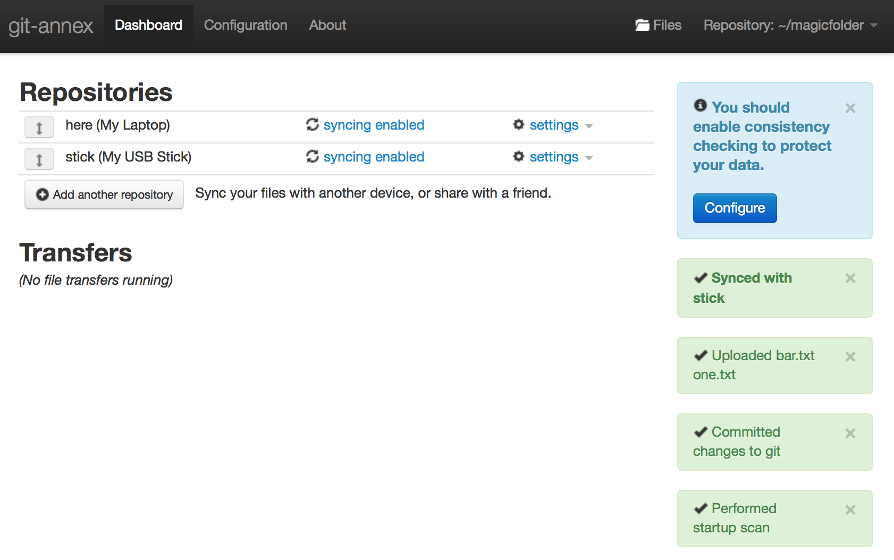
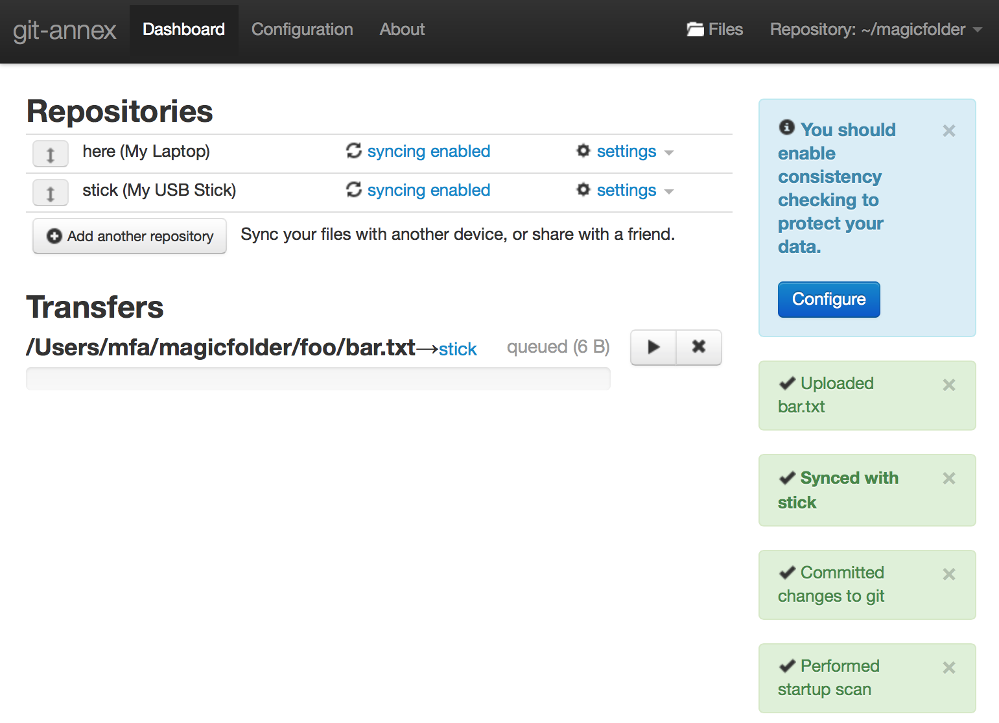

# **`git-annex` is magic**{data-state="start" data-background="http://upload.wikimedia.org/wikipedia/it/0/00/Matrix_Neo.jpg"}

> **a `shell adventure`**

# \ {data-background="http://upload.wikimedia.org/wikipedia/commons/5/53/The.Matrix.glmatrix.1.png"}


#  Open your Terminal{data-background="http://upload.wikimedia.org/wikipedia/commons/5/53/The.Matrix.glmatrix.1.png"}

> **This is a `shell adventure`**

````small
You can (safely) follow along by typing or copying 
all the commands into your terminal.

You'll need a relatively recent Linux or Mac system, and maybe 
an USB stick. The Stick can be simulated by any folder 
on the computer, so you can also try it out on any machine.

Commands are lines start start with a '$' sign, 
the '$' is not part of the command.
````

> **Try it out now:**

````shell
date "+%s"
````

````shell-output-date
1385670018
````

````{.small .alt}
^ There are snippets of the expected output, where it is important.
````


# Alias

For educational purposes, we **define an
alias**, \
so it is more clear when we
are using `git` or `git annex`.

````shell
alias magic="git annex"
````

We will be defining more variables in 
this adventure, \
so make sure to **not close your shell** 
(or edit `.bashrc`).

# Download

**Linux 32 Bit:**

````shell
cd ; wget 'http://bit.ly/tuxmagic32' -O git-annex-standalone-i386.tar.gz
````

  <!-- 'http://downloads.kitenet.net/\
  git-annex/linux/current/\
  git-annex-standalone-i386.tar.gz' -->

**Linux 64 Bit:**

````shell
cd ; wget 'http://bit.ly/tuxmagic64' -O git-annex-standalone-i386.tar.gz
````

  <!-- 'http://downloads.kitenet.net/\
  git-annex/linux/current/\
  git-annex-standalone-i386.tar.gz' -->

**OS X 10.9 Mavericks:**

````shell
curl 'http://bit.ly/macmagic9' > ~/anx.dmg
````

  <!-- 'http://downloads.kitenet.net/\
  git-annex/OSX/current/10.9_Mavericks/\
  git-annex.dmg' -->

**OS X 10.8.2 Mountain Lion:**

````shell
curl 'http://bit.ly/macmagic8'  > ~/anx.dmg.bz2
````

````shell
cd ~; tar xvzf anx.dmg.bz2
````

  <!-- 'http://downloads.kitenet.net/\
  git-annex/OSX/current/10.8.2_Mountain_Lion/\
  git-annex.dmg.bz2' -->


**OS X 10.7.5 Lion:**

````shell
curl 'http://bit.ly/macmagic7' > ~/anx.dmg
````

  <!-- 'http://downloads.kitenet.net/\
  git-annex/OSX/current/10.7.5_Lion/\
  git-annex.dmg' -->

# Install

**Linux:**

````shell
tar xvzf git-annex-standalone-i386.tar.gz
````

````shell
APP="~/git-annex.linux"
````

**OS X:**

````shell
open ~/anx.dmg
````

Drag and Drop App to `/Applications`

````shell
APP="/Applications/git-annex.app\
/Contents/MacOS"
````

# `$PATH`

- It should work via **`shell`** and **`ssh`**!

- Linux: at beginning of '/etc/bash.bashrc'!
    - user must have shell `/bin/bash` in `/etc/passwd`
- OSX: ~/.bashrc and ??? for ssh
- If it doesn't work: **`~/.bashrc`** is enough for this adventure

````shell
export PATH="$PATH":"$APP"
````

# **Save Point `#1`:** \
check install{#s1 data-background="hsl(150, 50%, 35%)" data-background-transition="slide"}

- in a **`shell`**

````shell
magic version
````

    git-annex version: 5.20131117-gbd514dc
    build flags: Assistant Webapp …
    key/value backends: SHA256E WORM …
    remote types: git directory…

- via **`ssh`** (optional)

````shell
ssh localhost 'git annex version'
````

    git-annex version: 5.20131117-gbd514dc
    …

> **`Works?`**

  ---

[**`Link to this point: <#s1>`**](#/s1)

  ---


# `>` Link

Hardcore install.

Do this **only if everything else failed** \
***or***
you are on a Mac and want to use it over `ssh`.

````shell
sudo ln -s "$APP/git-annex{,-shell} /usr/bin/."
````

````shell
sudo ln -s "$APP/bundle /usr/bin/bundle" # on Linux, there is no $APP/bundle
````

# Workflow

1. `init`
2. `add $FILES`
3. `clone`
4. setup & `sync`
5. `use`

# **`magic init`**{#init}

We start with a new folder. 
This could be your new Dropbox.

````shell
mkdir ~/magicfolder
````

````shell
cd ~/magicfolder
````

````shell
git init
````

    Initialized empty Git repository …

````shell
magic init 'My Laptop'
````

    init My Laptop ok
    (Recording state in git...)


# **`magic add`**

We make a sub-folder with 
a new text file inside.

````shell
cd ~/magicfolder
````

````shell
mkdir foo && echo 'simsalabim' > foo/bar.txt
````

````shell
magic add foo/bar.txt
````

    add foo/bar.txt (checksum...) ok
    (Recording state in git...)

````shell
git commit -m 'added'
````

    [master (root-commit) 67a2114] added
     1 file changed, 1 insertion(+)
     create mode 120000 foo/bar.txt


# **`magic sync`**

To make things easier, you can 
always use **`sync`**.

Should be done **after every change** 
(or in intervals w/ `cron`).

It does the following: 

- auto-**commit**
- **push** to all remotes
- **fetch** from all remotes
- **merge** with all remotes

````shell
cd ~/magicfolder
````

````shell
echo '1' > one.txt
````

````shell
magic sync
````

    commit  
    ok

# **`git clone`**

Now clone this repo
using any *git transport* (`file`, `ssh`, `https`,…).

Note that **`file`** works with everything
you can somehow mount,  
including **Dropbox**.

````shell
STICK="/Volumes/USBSTICK"

````

**Clone:**

````shell
git clone file://$HOME/magicfolder "$STICK/magicfolder"
````

*Alternative Clone: **`SSH`***

````{.shell .small .alt}
git clone user@host:magicfolder "$STICK/magicfolder"
````

Init:

````shell
cd "$STICK/magicfolder"
````

````shell
magic init 'My USB Stick'
````

    init My USB Stick 
    ok
    (Recording state in git...)


# **`magic sync`** #2

````shell
magic sync
````

    (merging origin/git-annex into git-annex...)
    (Recording state in git...)
    commit  
    ok
    pull origin 
    ok
    push origin 
    Writing objects: 100% (8/8), 776 bytes …
     * [new branch] git-annex -> synced/git-annex
    ok


# look what we've got

We seem to have our file…

````shell
ls foo/bar.txt
````

    foo/bar.txt

# connect the remotes

Standard git setup.

**For the Laptop:**

````shell
cd ~/magicfolder
````

````shell
git remote add stick "$STICK/magicfolder"

````

**For the stick:**

````shell
cd "$STICK/magicfolder"
````

The `origin` remote is not used
by `magic`, can be removed or not.

````shell
git remote remove origin # optional
````

````shell
git remote add laptop ~/magicfolder
````

# **`magic sync`** #3

With the configured remotes, **`sync`** now 
also does **`pull`** and **`push`**.

````shell
cd ~/magicfolder
````

````shell
magic sync
````

````small
(merging synced/git-annex into git-annex...)
commit  
ok
pull stick 
From /Volumes/USBSTICK/magicfolder
 * [new branch] git-annex  -> stick/git-annex
 * [new branch] master     -> stick/master
 * [new branch] synced/master -> stick/synced/master
ok
````

# Now what?

We have just cloned the meta data.

All the files and folder are on the stick, 
**as symlinks**!

**`magic`** takes care of the symlinks.

Metadata includes info about the remotes,
and what files they have **available**!

````shell
cd "$STICK/magicfolder"
````

````shell
ls foo/bar.txt # foo/bar.txt
````

# Just symlinks

We don't have the file's **content** yet, \
because we have not transfered it 
(just its *meta data*). 

We'll call this: "The file is **unavailable**".

````shell
cat foo/bar.txt
````

    cat: foo/bar.txt: No such file or directory

# Just symlinks

If we get a listing, we see where the symlinks points to \
(but the object file it points to – the *content* — is just not there).


````shell
ls -l foo/bar.txt
````

    lrwxrwxrwx  1 mfa  staff  191 Nov 28 14:02 
    foo/bar.txt -> ../.git/annex/objects/FP/vj/
    SHA256E-s11--9062535d58….txt/
    SHA256E-s11--9062535d58….txt


# **`magic get`** a file

So, how do we get the content?

To manually transfer files, use `get`.

````shell
cd "$STICK/magicfolder"
````

````shell
magic get foo/bar.txt
cat foo/bar.txt
````

    simsalabim

# **`magic drop`** a file

To delete a file just from 
a remote, use `drop`.

This is useful for making free
space on Laptops with small hard drives, etc.

````shell
cd "$STICK/magicfolder"
````

````shell
magic drop foo/bar.txt
````

````shell
cat foo/bar.txt # > "No such file or directory"
````

````shell
magic sync
````

# wait…, **what?**{data-background="http://upload.wikimedia.org/wikipedia/tr/0/05/Matrix_yeni_nesil_ajanlar.jpg"}

> **`drop`ping?**
> \
> \
> Isn't that a fancy word to say **`DELETE`**?
> \
> \
> **is this safe?**


# **YES it is safe!**

(unless you use the **`--force`**)

This is why we want to have a record
of all files and in which remotes they are.

Let's try 'dropping' it on our Laptop, too:

````shell
cd ~/magicfolder/
````

````shell
magic drop foo/bar.txt
````

````small
drop foo/bar.txt (merging synced/git-annex into git-annex...)
(unsafe) 
  Could only verify the existence of 0 out of 1 necessary copies
  (Use --force to override this check, or adjust annex.numcopies.)
failed
git-annex: drop: 1 failed
````

# ok, let's **`move`**

What if I just want to move a file to the stick?

- **`move --to`** a remote
- *also:* **`copy --to`**!
    

````shell
cd ~/magicfolder/
````

````shell
magic copy foo/bar.txt --to stick
````

````small
copy foo/bar.txt (to stick...) 
SHA256E-s11--9062535d58….txt
  11 100%    0.00kB/s    0:00:00 (xfer#1, to-check=0/1)

sent 173 bytes  received 42 bytes  430.00 bytes/sec
total size is 11  speedup is 0.05
ok
(Recording state in git...)
````

# **`magic whereis`**

We can also just get a list of a 
file availability in other remotes, \
without trying to drop it: 

````shell
cd ~/magicfolder
````

````shell
magic whereis foo/bar.txt
````

````small
whereis foo/bar.txt (2 copies) 
  	ab8aad2f-f87e-440e-baef-… -- here (My Laptop)
   	f7feb954-0250-4117-a368-… -- stick (My USB Stick)
ok
````


# **Save Point `#2`:**{#s2 data-background="hsl(150, 50%, 35%)" data-background-transition="slide"}

- **OK so far?** Cool.

- **Not ok?**

    - remove all
    
    ````{.shell .small}
    cd ; \
    sudo rm -rf \
    ~/magicfolder \
    "$STICK/magicfolder" 
    ````

    - `GOTO` **[init](#init)**

> **`Questions?`**

  ---

[**`Link to this point: <#s2>`**](#/s2)

  ---


# editing Files

Files are locked by default!

Also, while the **content** 
is not tracked in git by **`magic`**, \
you can still commit with git, and **`magic`** 
will take of it (w/ `git-hooks`).

````shell
cd ~/magicfolder
````

````shell
echo 'fail' > foo/bar.txt
````

    Permission denied

# `editing` Files

We need to unlock it first!

````shell
magic unlock foo/bar.txt
````

````shell
echo 'booya' > foo/bar.txt  # No error!

````

Now "commit and push".

````shell
magic add foo/bar.txt
````

````shell
git commit -m 'changed'
````

````shell
magic sync
````

# Syncing the edits

To get the file to the stick, 

````shell
cd "$STICK/magicfolder"
````

we **`sync`**, which fetches the meta data
with `git` \
and then **`get .`** *(everything)* to actually
transfer the file.

````shell
magic sync && magic get .
````

````shell
cat foo/bar.txt
````

    booya


# …"locking", eh?{data-background="http://upload.wikimedia.org/wikipedia/en/a/ac/TheArchitectMatrix.jpg"}

> Doesn't this locking/unlocking seem complicated \
> in comparison to, say, *Dropbox*?
> 
> **YES.** That is why we use ***'direct mode'***. 

# direct mode

You may now **forget** the slides about locking/editing.


````shell
cd ~/magicfolder
````

````shell
magic direct
````

    …
    direct  ok


# direct mode

All **available** files are **normal files**; \
all **unavailable** files are **symlinks** \
(and we can use `magic get` to make them available).

**Do something:**

````shell
echo 'pow' > foo/bar.txt
````

````shell
magic sync
````

**Sync it!**

````shell
cd "$STICK/magicfolder"
````

````shell
magic sync && magic get .
````

````shell
cat foo/bar.txt #
````

    pow

*Note:* We could also have used **`copy --to stick`**.

<!-- # conflicts

````shell
cd ~/magicfolder
echo 'author: alice' > foo/bar.txt

cd "$STICK/magicfolder"
magic direct # > "direct  ok"
echo 'author: bob' > foo/bar.txt

magic sync

magic sync && magic get .
cat foo/bar.txt # > "pow"
```` -->


# special remotes

**Usage:** If you just want to copy somewhere,
for *backup* or *transfer*.

If you'll look at the directory, 
it will just be a bunch of object files.

Special remotes are (`GPG`) [encrypted][encryption] 
by default, \
so you have to explicitly turn it off 
(`encryption=none`).

Once setup with **`initremote`**, \
**`magic`** can 
use them like any other remote – it *just works*™.

# encrypted folder in Dropbox

The remote will have a name and a GPG key.

```shell
BOX=dropbox # how to call the remote
```

```shell
KEY=965113EA # your GPG key id
```

**Make a new folder in the Dropbox:**

```shell
mkdir -p ~/Dropbox/BACKUP/magic/
```

````shell
cd ~/magicfolder
````

```shell
magic initremote $BOX type=directory \
directory=~/Dropbox/BACKUP/magic/ \
keyid=$KEY
```

```
initremote dropbox (encryption setup) 
(hybrid cipher with gpg key 3771835A3BADB56D) ok
```

***Alternative** if you don't have a key handy (unecrypted):*

```{.shell .alt}
magic initremote $BOX type=directory \
directory=~/Dropbox/BACKUP/magic/ \
encryption=none
```


# encrypted `copy` to Dropbox

Like any other remote, just a password prompt for the key.

````shell
cd ~/magicfolder
````

```shell
magic copy . --to $BOX
```

```small
copy foo/bar.txt (gpg) 
You need a passphrase to unlock the secret key for
user: "Max F. Albrecht <1@178.is>"
4096-bit RSA key, ID 965113EA, created 2013 (main key ID FOO)

(to dropbox...)
ok
```

# more special remotes

- `xmpp` (jabber!)
- `rsync`
- `bup`
- `web`
- `webdav`
- (Amazon) S3
- Amazon Glacier
- [More in the Docs][sremotes]


# more backends 

- how files are matched with
they meta data. \
obviously very important.

- default is **`SHA256E`**, a file hash plus the file extension

- **`WORM`**: alternative if you don't want hashing, uses just file name, date, etc. usefull if:
      a) you trust the disk *or*
      b) you don't care
      c) performance (2 TB Videos @ Raspberry Pi)

````shell
cd ~/magicfolder
````

```shell
echo '* annex.backend=WORM' > .gitattributes
```

# **Save Point `#3`:**{#s3 data-background="hsl(150, 50%, 35%)" data-background-transition="slide"}

Use the **direct mode for normal folders**, \
and the indirect mode for normal git repos + magic.

Use **`sync`** to **sync meta data** between remotes.

Use **`get`**, **`drop`**, **`copy`** and **`move`** 
to **sync content** between remotes.

> **`Questions?`**

  ---

[**`Link to this point: <#s3>`**](#/s3)

  ---


# **`assistant`**{data-background="http://31.media.tumblr.com/48aff1d20ba83e294a987bcf601858c9/tumblr_mgtp10uvr41rywaz8o1_500.gif" data-background-transition="slide"}
# **`assistant`**

- daemon
- watches folders (also: just **`magic watch`**)
- show repos, remotes, transfers
- remote settings

````shell
cd ~/magicfolder
````

```shell
magic assistant # or 'magic webapp' to re-open
```


<!-- # screenshot


 -->

# screenshot




# **`assistant`**: \
internals

- uses **direct** mode by default
- uses only **special** remotes by default
    - good bc. encrypted
- apart from that, **everything done manually** still works!


# tipps & tricks

- **`--fast`** do stuff faster. \
  For example, rely on local data instead of updating before checking.

- **`magic fsck`**: for the data conscious

- **`magic describe`**: change the description \
  that was set with **`magic init 'My Laptop'`**.

- always try to use the faster machine for hashing…

# Links:

- [`manpage`][man]
- [special remotes][sremotes]
- [encryption][encryption]


[man]: <http://git-annex.branchable.com/git-annex/>

[encryption]: <http://git-annex.branchable.com/encryption/>

[sremotes]: <http://git-annex.branchable.com/special_remotes/>


# fin

made with [**`pandoc`**](http://johnmacfarlane.net/pandoc/) and [**`reveal.js`**](http://lab.hakim.se/reveal-js/).


<!-- some styles and scripts-->

<style>
body .reveal, body .reveal h1 {
  font-family: 'Source Sans Pro';
}
.reveal code {
  font-family: 'Source Code Pro';
}
hr {
  width: 33.34%;
  border: none;
  border-bottom: 0.2em solid;
}
body .reveal h1 {
  font-weight: 600;
}
.reveal pre {
  font-size: 1em;
}
.reveal ul pre code, 
.reveal ol pre code {
  width: 120%;
}
.reveal pre code,
.reveal blockquote {
  font-style: normal;
  background: hsl(150, 0%, 17%);
}
.reveal pre.shell code {
  background: hsl(150, 50%, 17%);;
  font-weight: 500;
}
.reveal pre.shell code::before {
  content: "\0024\0020";
}
.reveal pre.alt code {
  background: hsl(70, 50%, 17%);;
}
.reveal pre.small code {
  font-size: 0.75em;
  font-weight: 500;
}
#alias-magicgit-annex h1 {
  font-size: 2.4em;
}
#gh-ribbon {
  display: none;
}
html.start #gh-ribbon {
  display: block;
}
</style>
<script type="text/javascript" charset="utf-8" src="https://code.jquery.com/jquery-1.10.2.min.js">
</script>
<script type="text/javascript" charset="utf-8">
$(document).ready(function () {
  // clock
  var start = false,
    $clock=$('.shell-output-date').find('code');
  (function updateTime() {
    var d = parseInt(((new Date).getTime()/1000), 10);
    $clock.html(d);
    if (!start) {
      start = d.toString();
    }
    if ((start - d) <= 100) {
      setTimeout(updateTime, 1000);
    }
  }());
});
</script>
